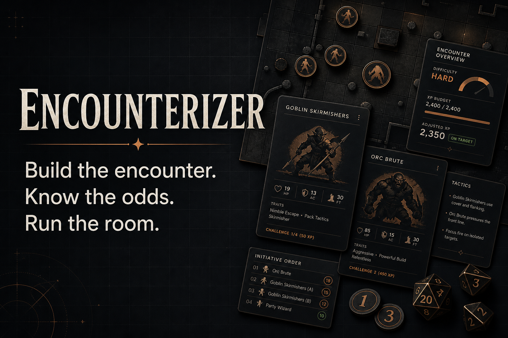

# Encounterizer

[](https://github.com/Daren9m/Encounterizer/actions/workflows/ci.yml)
[](LICENSE)



A free D&D 5.5e (2024 rules) toolkit for Dungeon Masters: build balanced
encounters, forecast the battle before your party rolls initiative, and run
the whole session — prep tools, live battle support, and searchable SRD rules
in one place. No accounts, no server, no cost. Everything runs in your browser.

> **Live site:** coming soon on Azure Static Web Apps — see
> [Deployment](#deployment).

## The Tools

- **⚔️ Encounter Builder** — Set party size, level, and difficulty; get a
  balanced encounter with monsters, scenario hook, tactics, treasure, and an
  optional battle map. Uses the real **2024 DMG XP budgets**
  (Low/Moderate/High — no 2014 multipliers). Every generated encounter is
  seeded: **Copy Link** produces a URL that regenerates the exact same
  encounter for anyone. Save named encounters for later sessions.
- **🔮 Battle Forecast** — One click runs **1,000 Monte Carlo battle
  simulations** against your actual party (pick class templates and levels,
  tweak the numbers if you like). Get the win rate, expected rounds,
  round-by-round HP curve, who's most likely to drop, and an honest
  "the XP says Moderate, but this plays like Deadly" assessment. It's a
  weather forecast, not a promise — but no mainstream encounter builder
  does it.
- **🐉 Monster Bestiary** — **331 monsters from the SRD 5.2.1** (genuine
  2024 stat blocks), each with a dedicated portrait, plus deep filtering:
  CR, type, size, environment,
  movement modes, damage types dealt, resistances, immunities, conditions,
  legendary/spellcaster/lair toggles. **Import your own monsters** from
  5etools bestiary JSON or Encounterizer exports — stored locally in your
  browser, merged into every tool.
- **🗺️ Map Generator** — Procedural battle maps: BSP room-and-corridor
  dungeons, cellular-automata caves, and environment-specific outdoor
  terrain. Export as JSON or ASCII.
- **🧩 Puzzles & Challenges** — One seeded generator: verified logic/word/spatial puzzles, riddles, ciphers, contests, plus social encounters, journeys, traps, chases, and investigations.
- **🛡️ DM Screen** — Build a private command screen from monsters, spells,
  rules, notes, tool links, and a compact live battle tracker.
- **⚔️ Battle Organizer** — Sort initiative and track HP, conditions,
  concentration, reactions, legendary actions, rounds, and turn flow.
- **📖 DM Reference** — Search, expand, print, or export 33 concise SRD 5.2.1
  references covering checks, conditions, combat, recovery, movement, and sight.
- **✨ Spell Reference** — **All 339 spells from the SRD 5.2.1** (levels
  0–9, verbatim 2024 rules text) with instant search, mechanics-first
  summaries, filters for level/school/class/concentration/ritual, and
  side-by-side pinning. **Import your own spells** from 5etools spell JSON
  or Encounterizer exports — stored locally in your browser.

Every prep page has a **Print** button with a dedicated print stylesheet —
clean, ink-friendly handouts straight from the browser. Settings, histories,
pinned spells, saved encounters, and your party configuration persist in
localStorage between visits.

## Tech Stack

| Layer | Technology |
|-------|-----------|
| Framework | Next.js 16 (App Router, static export) |
| Language | TypeScript (strict) |
| Styling | Tailwind CSS + CSS custom properties (Dusksteel tokens), Spectral + IBM Plex Sans via next/font, Lucide icons |
| Data | Generated TypeScript bestiary, spells, magic items, feats, and origins from SRD 5.2.1; client-side 5etools importers |
| Testing | Vitest (140+ tests: rules math, importer, Monte Carlo statistics) |
| CI/CD | GitHub Actions → Azure Static Web Apps (free tier) |
| Hosting cost | $0 |

## Project Structure

```
src/
  app/                       # Next.js App Router (fully static — no server code)
    page.tsx                 # Landing page (stats computed from data modules)
    encounters/              # Encounter Builder + Battle Forecast
    monsters/                # Bestiary + custom monster import
    maps/                    # Map Generator
    noncombat/               # Puzzles & Challenges
    dm-screen/               # Configurable DM command screen
    battle/                  # Live initiative and combat organizer
    reference/               # Searchable rules and conditions
    spells/                  # Spell Reference
    credits/                 # SRD attribution + licensing
    icon.svg, opengraph-image.png, robots.ts, sitemap.ts
  components/
    NavBar.tsx               # Responsive nav with active states
    FilterPanel.tsx          # Full-criteria monster filter UI
    MonsterStatBlock.tsx     # 5e-style stat block renderer
    MapGrid.tsx              # Grid map display with terrain legend
    PartySetupPanel.tsx      # Battle Forecast party configuration
    BattleReportCard.tsx     # Forecast results (SVG donut + HP curve)
    CustomMonsterPanel.tsx   # JSON import / manage custom monsters
    DifficultyBadge.tsx, PrintButton.tsx
  lib/
    types.ts                 # Core type system + 2024 XP budget table
    encounter-generator.ts   # Budget math, knapsack selection, hooks/tactics/treasure
    battle-sim.ts            # Seeded Monte Carlo combat engine
    monster-to-sim.ts        # Stat block → simulator stats extraction
    monster-filter.ts        # Search/filter engine
    map-generator.ts         # BSP + cellular automata + outdoor scatter
    noncombat/generate.ts    # Unified orchestrator: puzzles & challenges (one seeded gen)
    encounter-recipes.ts     # Recipe-based encounter templates (engine)
    import-5etools.ts        # 5etools JSON → Monster converter (2024 format)
    custom-monster-import.ts # Client-side JSON import with validation
    random.ts                # Shared seeded RNG (shareable-link determinism)
    storage.ts               # SSR-safe localStorage utility
  data/
    monsters-*.ts            # AUTO-GENERATED SRD 5.2.1 bestiary (7 CR bands)
    bestiary-meta.ts         # Generated count + source commit
    class-templates.ts       # Battle Forecast class builds (15 × 4 tiers)
    spells.ts                # Spell type + search/filter helpers (aggregates the bands)
    spells-l*.ts             # AUTO-GENERATED SRD 5.2.1 spells (4 level bands)
    spells-meta.ts           # Generated count + source commit
    spell-summaries.ts       # Hand-curated effect summary overrides
    magic-items-*.ts         # AUTO-GENERATED SRD magic items (rarity bands)
    feats.ts                 # AUTO-GENERATED SRD feats
    backgrounds.ts           # AUTO-GENERATED SRD backgrounds
    species.ts               # AUTO-GENERATED SRD species
scripts/
  import-bestiary.ts         # Regenerates monster data from 5etools (npm run import:bestiary)
  import-spells.ts           # Regenerates spell data from 5etools (npm run import:spells)
  import-srd-content.ts       # Regenerates magic items, feats, and origins from pinned Markdown
```

## Getting Started

### Prerequisites
- Node.js 20+
- npm

### Install and Run

```bash
git clone https://github.com/Daren9m/Encounterizer.git
cd Encounterizer
npm install
npm run dev
```

Open [http://localhost:3000](http://localhost:3000).

### Scripts

```bash
npm run dev              # Development server
npm run build            # Static export → out/
npm run typecheck        # tsc --noEmit
npm run lint             # ESLint (next/core-web-vitals)
npm test                 # Vitest suite
npm run import:bestiary  # Regenerate the SRD bestiary from the pinned source
npm run import:spells    # Regenerate the SRD spell reference from the pinned source
npm run import:srd       # Regenerate structured SRD content from pinned Markdown
npm run srd:check        # Audit every committed SRD corpus (no network)
```

## Monster Database

**331 monsters from the System Reference Document 5.2.1** — the
CC-BY-4.0-licensed subset of the 2024 Monster Manual — spanning CR 0 (Frog)
to CR 30 (Tarrasque), with genuine 2024 stat values. The data files are
generated by `scripts/import-bestiary.ts` from a pinned 5etools source
commit and never edited by hand; an audit gate fails the import on
unstripped formatting tags, lost attacks, or missing XP.

Want more? The Bestiary page imports additional monsters from **5etools
bestiary JSON** or Encounterizer's own export format — converted and
validated entirely in your browser, never uploaded anywhere.

## Spell Reference

**339 spells from the System Reference Document 5.2.1** — every SRD spell
from cantrips to 9th level, with verbatim 2024 rules text, generated by
`scripts/import-spells.ts` from a pinned 5etools source commit and never
edited by hand. An audit gate enforces exact corpus counts, licensing name
checks, format whitelists, and field-coverage parity on every regeneration.
The bold one-line effect summaries are layered: hand-curated overrides in
`src/data/spell-summaries.ts` win over machine-synthesized mechanics lines.

## Structured SRD Library

The committed data layer also contains **257 magic items, 17 feats, 4
backgrounds, and 9 species** from SRD 5.2.1. `scripts/import-srd-content.ts`
parses per-entry Markdown from a pinned SRD-reForged commit, applies a small
audited correction ledger for known PDF transcription boundaries, and emits
typed, formatting-free records. See the [pipeline documentation](docs/srd-content-pipeline.md).

Like the bestiary, the Spells page imports additional spells from **5etools
spell JSON** or Encounterizer exports — converted and validated entirely in
your browser, never uploaded anywhere.

## Encounter Math

Uses the official 2024 Dungeon Master's Guide encounter-building rules:
- XP Budget per character level and difficulty tier (Low/Moderate/High)
- Raw monster XP compared directly against the budget — the 2024 rules
  dropped the 2014 monster-count multiplier entirely
- Encounters exceeding the High budget are flagged **Extreme** (a house
  label — the DMG defines nothing above High)
- Knapsack-style monster selection that fills the budget with variety
- Every generated encounter embeds its RNG seed: **Copy Link** produces a
  URL that regenerates the exact same encounter and map

The encounter generator also produces scenario hooks, per-type tactics,
and treasure by CR tier.

## Battle Forecast

The simulator models initiative, attack rolls, crits, multiattack routines,
breath-weapon recharges, legendary actions, healing, Rage damage reduction,
Sneak Attack, and Evasion. Monster stats are extracted automatically from
their stat blocks; caster monsters whose damage lives in spell text get a
CR-appropriate damage floor so a Lich never simulates as a pushover.
Deliberate simplifications (KO is final, AoE hits two targets) are part of
the design — the report brands itself a forecast and lists any
approximations it made.

## Map Generation

Three procedural algorithms:
- **BSP (Binary Space Partition)** — dungeon rooms connected by L-shaped corridors, with doors, stairs, traps, treasure, pillars
- **Cellular Automata** — organic cave systems (Underdark, mountain caves, planar rifts) with guaranteed connectivity
- **Outdoor Scatter** — environment-specific terrain (forest vegetation, swamp water, desert dunes, arctic ice, rivers with bridges)

Every map comes with **keyed rooms** — names, DM purposes, and read-aloud
text — rendered as a clean-tactical SVG battle map with coordinate rulers
and room-number chips. Exports: PNG, Markdown (grid + room key), JSON,
ASCII text, and **UVTT (.dd2vtt)** with line-of-sight walls and door
portals for Foundry-style importers.

Maps are seeded and shareable (`/maps?seed=…`). Maps generated alongside
encounters share the encounter's seed, so shared links reproduce the map,
the room key, AND the suggested token placement (party spawns, monster
zones, boss room). With a map attached, the Battle Forecast runs **on the
grid**: movement, weapon ranges, difficult terrain, and chokepoints all
shape the outcome, and the report shows rounds-to-contact alongside its
usual statistics.

## Deployment

The site is a pure static export deployed to **Azure Static Web Apps
(free tier)** by `.github/workflows/deploy.yml` on every push to the
default branch. One-time setup:

1. Azure Portal → **Create resource → Static Web App** → Plan: **Free** →
   Deployment source: **Other** (important — choosing "GitHub" makes Azure
   commit its own competing workflow).
2. After creation, copy the site URL from Overview and the deployment token
   from **Manage deployment token**.
3. In the GitHub repo: Settings → Secrets and variables → Actions → add
   **secret** `AZURE_STATIC_WEB_APPS_API_TOKEN` (the token) and
   **variable** `SITE_URL` (the URL, e.g. `https://<name>.azurestaticapps.net`).
4. Push to the default branch (or re-run the Deploy workflow). Verify the
   live site, deep-link refreshes, and the themed 404 page.

## Design Principles

1. **No LLM dependency** — All generation is algorithmic. No API calls, no ongoing AI costs.
2. **Client-side first** — Computation happens in the browser. The host serves static files.
3. **Free to run** — Azure Static Web Apps free tier ($0/month).
4. **2024 rules** — 5.5e / 2024 encounter math and SRD 5.2.1 stat blocks. DMs rely on these numbers at the table.
5. **DM-centric** — Every feature answers "does this save the DM time during prep or at the table?"
6. **Legally clean** — Ships only CC-BY-4.0 SRD content; anything else stays on the user's own device.

## Roadmap

See [GitHub Issues](https://github.com/Daren9m/Encounterizer/issues) and
the [milestones](https://github.com/Daren9m/Encounterizer/milestones) for
the full backlog. Highlights:

- **Character Import** (#10) — Parse D&D Beyond links, PDFs, or sheet images into Battle Forecast parties
- **Enhanced Export** (#15) — PDF stat blocks (map VTT export shipped with the Map Generator Overhaul)
- **Battle Forecast Phase 2/3** — death saves, AoE modeling, save-or-suck conditions, "what if?" suggestions

## Security

Please report suspected vulnerabilities privately. See the
[Security Policy](SECURITY.md) for supported versions, reporting instructions,
and disclosure expectations.

## Licensing

- **Code:** [MIT](LICENSE).
- **Game content:** This work includes material from the System Reference
  Document 5.2.1 ("SRD 5.2.1") by Wizards of the Coast LLC, available at
  <https://www.dndbeyond.com/srd>. The SRD 5.2.1 is licensed under the
  Creative Commons Attribution 4.0 International License
  (<https://creativecommons.org/licenses/by/4.0/legalcode>).
- Encounterizer is unofficial fan content, not affiliated with or endorsed
  by Wizards of the Coast. See the in-app [Credits page](src/app/credits/page.tsx).
